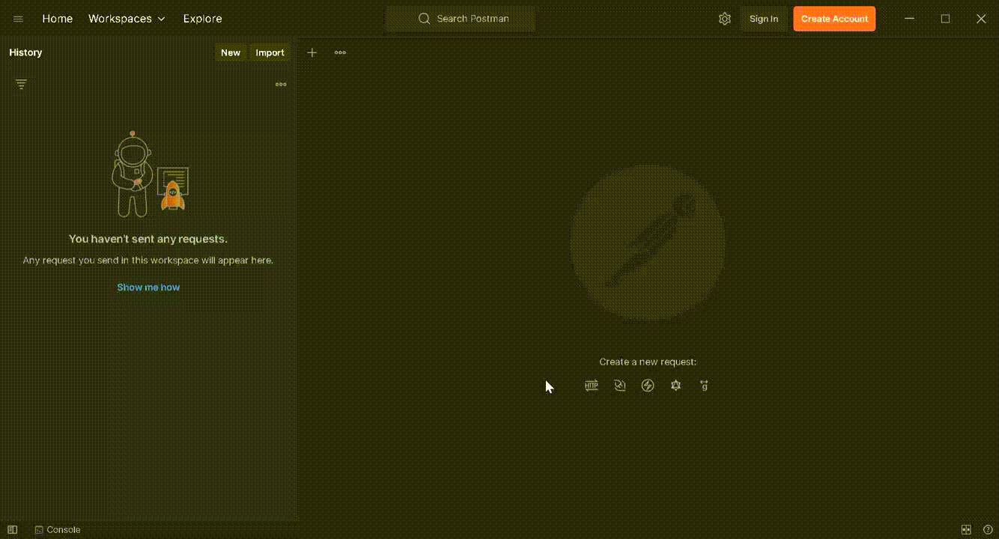

# Basic Blog Backend (Basic Blog - Astro.js)

- [Database Schema](#database-schema)
- [Server overview](#server-overview)
- [Auth](#authorization)
- [Postman](#postman)
- [References]()

## Database Schema

The database schema or model can be found in `/model/basic-blog-dev.session.sql` file. The schema looks as follows:

```sql
CREATE TABLE users (
    id SERIAL NOT NULL PRIMARY KEY,
    username TEXT NOT NULL,
    password_hash TEXT NOT NULL,
    pfp BYTEA NOT NULL DEFAULT decode('somedefaultbase64', 'base64'),
    pfp_mime TEXT NOT NULL DEFAULT 'image/png',
    -- the default base64 image I used has this mimetype
    about TEXT,
    registered_at TIMESTAMPTZ NOT NULL DEFAULT now(),
    refresh_token TEXT
);
CREATE TABLE blogs (
    id SERIAL NOT NULL PRIMARY KEY,
    content TEXT NOT NULL,
    title TEXT NOT NULL,
    author_id INT NOT NULL,
    created_at TIMESTAMPTZ NOT NULL DEFAULT now(),
    updated_at TIMESTAMPTZ NOT NULL DEFAULT now(),
    slug TEXT NOT NULL,
    CONSTRAINT fk_author_id FOREIGN KEY(author_id) REFERENCES users(id)
);
```

The profile picture of users are stored as `BYTEA` datatype. This is just binary decoded from a base64 image that I encode as base64 when I query the database. It is more adequate to use the file system for storing files but these profile pictures are resized using the `npm` module `sharp`. There are also other problems with using `fs` when you're deploying serverless and I have discussed it thoroughly here: [Basic Blog - ejs.](https://github.com/MarisaCodes/basic-blog#postgresql-db-structure)

## Server Overview

A nodejs server using `express`.

```js
const express = require("express");
const morgan = require("morgan");
require("dotenv").config();

const app = express();
```

Some middleware for development purposes like `morgan` to output logs of server requests and responses for debugging issues and just improving the overall ease of development.

The actual functions that handle user requests and respond to those requests are in the controllers folder. The routers folder makes use of `express.Router()` to create a mini app within the file and handle user requests to the specified routes.

Some important middleware functions I am using:

```js
...
app.use(express.json()) // to parse json body in request
app.use(cookieParser()) // to parse cookies
...
const upload = multer({ storage: multer.memoryStorage() })
route.post("/signup", upload.single("pfp"), (req, res, next) => {
    // multer stores the uploaded file in req.file
    // "pfp" is the name of the file upload form field
    // req.file.buffer for e.g. has the file buffer
    // req.file.mimetype has the mime-type of the file
    // req.body is any text field in the form field if there were any
})
...
```

`CookieParser` is invoked from an npm package:

```
npm install cookie-parser
```

`multer` package:

```
npm install multer
```

## Authorization

I have decided to make use of `jsonwebtoken` for this project:

```
npm install jsonwebtoken
```

Two tokens are created on signup, an access token that is set as an `httpOnly` cookie and a refresh token that is stored in the database to refresh the access token whenever it expires for a specific duration. The refresh token expires after the access token. This is (arguably) safer than storing the cookie in session or local storage because the vulnerability to XSS attacks would be higher. However, setting `httpOnly` cookies still makes you vulnerable to XSRF attacks. I will look into `cors` policy, whitelisting, and `SameSite` later when I start working on the frontend to try and mitigate XSRF vulnerabilities.

Note: for password hashing I have used `bcrypt`:

```
npm install bcrypt
```

## Postman

By the time I have finished the sign up page logic and some of the auth middleware (for token expiry verification) I started using postman to test out my REST API routes.

Example: User signup API



So first I make a get requests to http://localhost:3050/api/
This gives me `200` status code, with an error message "wow such empty" since I still don't have any blogs posted. And the user is set to `null` by action of some auth/token verification middleware. The get request is successful but no user is logged in (i.e. no valid token in cookie) and no blog data is on the database.

I then sign up using an authorization header `Basic auth`. User data is encrypted in a `base64` string. I also upload an image for the sake of demonstration. After that, for every other request I make I send a `json` body that looks like:

```json
{
  "username": "<username here>"
}
```

As long as there is an access token in the cookies (meaning the user either signed up or logged in at some point before that request) then I will always have access to the username every request regardless of the token's validity (expired or not). This is very important because when the access token expires (which it must do often) I must query the database for the refresh token. But I can never do that with an expired jwt. So, the solution is sending this json body. When the refresh token finally expires the cookies are cleared and you get back to the initial state where I get `{ user:null }` at the start of the video.

The rest is standard routing. I handle get requests to signup and login pages while the user is logged in by sending a `302` status code indicating a redirect must happen. Otherwise, `200` is sent indicating that the user can indeed signup or login when they have no valid session.

### References

---

- [json web tokens npm](https://www.npmjs.com/package/jsonwebtoken)
- [password hashing with bcrypt](https://blog.logrocket.com/password-hashing-node-js-bcrypt/#:~:text=It%20is%20important%20to%20salt,that%20makes%20the%20hash%20unpredictable.)
- [bcrypt npm](https://www.npmjs.com/package/bcrypt?activeTab=readme)
- [multer npm](https://www.npmjs.com/package/multer)
